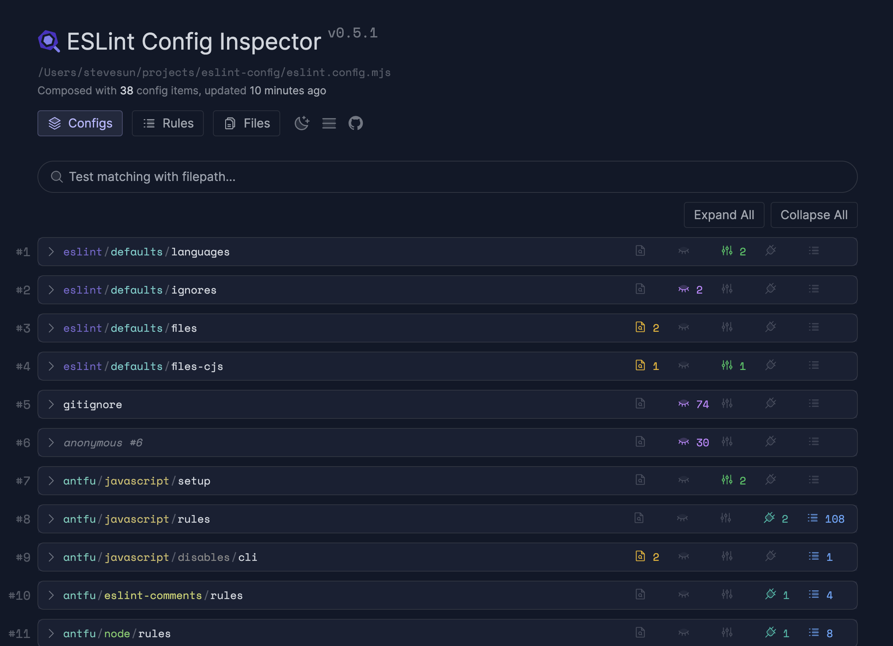

# OneAd ITO ESLint Config

### Powered by [@antfu/eslint-config](https://github.com/antfu/eslint-config/tree/main)

- 整合[eslint-plugin-tailwindcss](https://github.com/francoismassart/eslint-plugin-tailwindcss)，對 tailwind class 進行排序。
- 整合[eslint-plugin-simple-import-sort](https://github.com/lydell/eslint-plugin-simple-import-sort)，對 import 進行排序。
- 由[eslint-stylistic](https://github.com/eslint-stylistic/eslint-stylistic)進行排版，並不會強制換行，可自行在開發時手動用 prettier 排版。
- 採用[ESLint Flat Config](https://eslint.org/docs/latest/use/configure/configuration-files)模式(ESLint >= v8.57.0)，擴充與設定更方便。

## Install

1. `pnpm add -D @ito-frontend/eslint-config`
2. `cmd+shift+p` > `Preferences: Open Workspace Settings (JSON)` > 貼上。

```jsonc
{
  "editor.formatOnSave": false,

  // Auto fix
  "editor.codeActionsOnSave": {
    "source.fixAll.eslint": "explicit",
    "source.organizeImports": "never"
  },

  // Silent the stylistic rules in you IDE, but still auto fix them
  "eslint.rules.customizations": [
    { "rule": "style/*", "severity": "off", "fixable": true },
    { "rule": "format/*", "severity": "off", "fixable": true },
    { "rule": "*-indent", "severity": "off", "fixable": true },
    { "rule": "*-spacing", "severity": "off", "fixable": true },
    { "rule": "*-spaces", "severity": "off", "fixable": true },
    { "rule": "*-order", "severity": "off", "fixable": true },
    { "rule": "*-dangle", "severity": "off", "fixable": true },
    { "rule": "*-newline", "severity": "off", "fixable": true },
    { "rule": "*quotes", "severity": "off", "fixable": true },
    { "rule": "*semi", "severity": "off", "fixable": true }
  ],

  // Enable eslint for all supported languages
  "eslint.validate": [
    "javascript",
    "javascriptreact",
    "typescript",
    "typescriptreact",
    "vue",
    "html",
    "markdown",
    "json",
    "jsonc",
    "yaml",
    "toml",
    "xml",
    "gql",
    "graphql",
    "astro",
    "svelte",
    "css",
    "less",
    "scss",
    "pcss",
    "postcss"
  ]
}
```

4. 專案新增`eslint.config.mjs`

```ts
// ito工廠函數的參數
type ItoConfigParams = {
  /**
   * 框架
   * @default 'vue'
   */
  framework?: 'vue' | 'react' | 'astro';
  /**
   * Vue的版本號
   * @default 3
   */
  vueVersion?: 2 | 3;
  /**
   * 是否有使用Tailwind
   * @default false
   */
  tailwind?: boolean;
  /**
   * 是否有使用TypeScript
   * @default true
   */
  typescript?: boolean;
  /**
   * 是否要啟用檔案命名規則
   * @default false
   */
  checkFile?:
    | boolean
    | { enabled: boolean; ignores?: []; files?: []; fileNamingStyle?: string; folderNamingStyle?: string };
  /**
  /**
   * 其他自定義ESLint Flat Configs
   * @default []
   */
  otherConfigs?: TypedFlatConfigItem[];
};
```

```ts
// eslint.config.mjs
import ito from '@ito-frontend/eslint-config';

export default ito({
  framework: 'react',
  typescript: false,
  tailwind: true,
  checkFile: { enabled: true, ignores: ['README.md', 'src/routes/**/*'] },
});
```

5. 想確認所有規則

```jsonc
// package.json
{
  "scripts": {
    // ...
    "rules:inspect": "npx @eslint/config-inspector"
  }
}
```



<details>
<summary>新增其他Flat Configs</summary>

```ts
// eslint.config.mjs
import ito from '@onead-ito/eslint-config';
import pluginCypress from 'eslint-plugin-cypress/flat';
import sonarjs from 'eslint-plugin-sonarjs';

const cypressConfig = [
  pluginCypress.configs.recommended,
  {
    rules: {
      'cypress/no-unnecessary-waiting': 'off',
    },
  },
];

const sonarConfigs = [
  sonarjs.configs.recommended,
  {
    plugins: {
      sonarjs,
    },
  },
];

export default ito({
  otherConfigs: [...cypressConfig, ...sonarConfigs],
});
```

## Publish

1. `pnpm release`，`bumpp`會自動提升版號。
2. 到 Github 中新增 release，之後觸發 Github Actions 自動發布 package。
