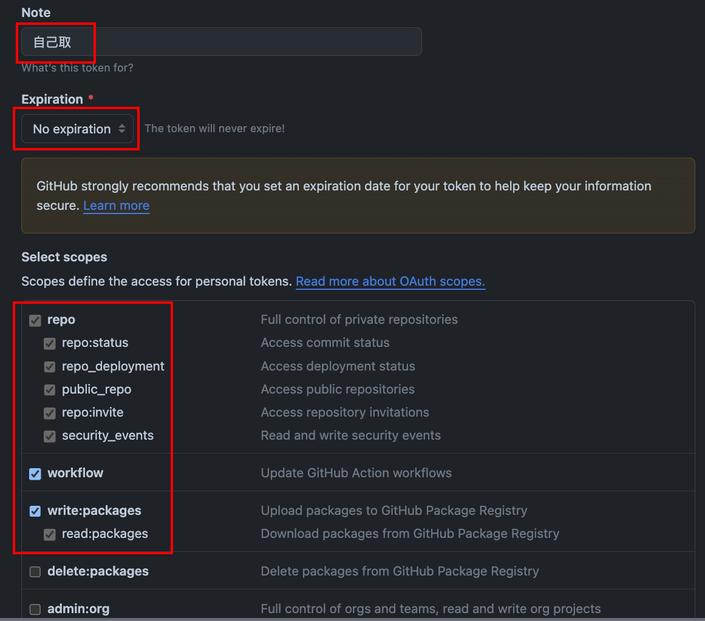

# OneAd ITO ESLint Config

### Powered by [@antfu/eslint-config](https://github.com/antfu/eslint-config/tree/main)

- 整合[eslint-plugin-tailwindcss](https://github.com/francoismassart/eslint-plugin-tailwindcss)，對 tailwind class 進行排序。
- 整合[eslint-plugin-simple-import-sort](https://github.com/lydell/eslint-plugin-simple-import-sort)，對 import 進行排序。
- 由[eslint-stylistic](https://github.com/eslint-stylistic/eslint-stylistic)進行排版，並不會強制換行，可自行在開發時手動用 prettier 排版。
- 採用[ESLint Flat Config](https://eslint.org/docs/latest/use/configure/configuration-files)模式(ESLint >= v8.57.0)，擴充與設定更方便。
- 自動判斷是使用 react 還是 vue。

## Github 私服連結方式，設定過後可以跳過

1. 在 Github 上新增`Personal access tokens`。
   <br />路徑為`Settings > Developer settings > Personal access tokens > Tokens (classic) > Generate new token (classic)`
   

2. npm 設置全局 registry，`YOUR_ACCESS_TOKEN`替換成 Github 的 Personal access tokens。

```bash
npm config set @ito-frontend:registry https://npm.pkg.github.com/ && npm config set //npm.pkg.github.com/:_authToken=YOUR_ACCESS_TOKEN
```

## Install

1. 確認是否有設定好[registry](#github私服連結方式設定過後可以跳過)
2. `pnpm add -D @ito-frontend/eslint-config`
3. `cmd+shift+p` > `Preferences: Open Workspace Settings (JSON)` > 貼上。

```jsonc
{
  // Disable the default formatter
  "editor.formatOnSave": false,

  // Auto fix
  "editor.codeActionsOnSave": {
    "source.fixAll.eslint": "explicit",
    "source.organizeImports": "never"
  },

  // Silent the stylistic rules in you IDE, but still auto fix them
  "eslint.rules.customizations": [
    { "rule": "@stylistic/*", "severity": "off" },
    { "rule": "*-indent", "severity": "off" },
    { "rule": "*-spacing", "severity": "off" },
    { "rule": "*-spaces", "severity": "off" },
    { "rule": "*-order", "severity": "off" },
    { "rule": "*-dangle", "severity": "off" },
    { "rule": "*-newline", "severity": "off" },
    { "rule": "*quotes", "severity": "off" },
    { "rule": "*semi", "severity": "off" }
  ],

  // The following is optional.
  // It's better to put under project setting `.vscode/settings.json`
  // to avoid conflicts with working with different eslint configs
  // that does not support all formats.
  "eslint.validate": [
    "javascript",
    "javascriptreact",
    "typescript",
    "typescriptreact",
    "vue",
    "html",
    "markdown",
    "json",
    "jsonc",
    "yaml"
  ]
}
```

4. 專案新增`eslint.config.mjs`

```ts
// ito工廠函數的參數
type ItoConfigParams = {
  /**
   * Vue的版本號
   * @default 3
   */
  framework?: 'vue' | 'react';
  /**
   * Vue的版本號
   * @default 3
   */
  vueVersion?: 2 | 3;
  /**
   * 是否有使用Tailwind
   * @default false
   */
  tailwind?: boolean;
  /**
   * 其他自定義ESLint Flat Configs
   * @default []
   */
  otherConfigs?: TypedFlatConfigItem[];
};
```

```ts
// eslint.config.mjs
import ito from '@ito-frontend/eslint-config';

export default ito({
  framework: 'react',
  tailwind: true,
});
```

5. 想確認所有規則

```jsonc
// package.json
{
  "scripts": {
    // ...
    "lint:rules": "npx @eslint/config-inspector"
  }
}
```


<details>
<summary>新增其他Flat Configs</summary>

```ts
// eslint.config.mjs
import ito from '@onead-ito/eslint-config';
import pluginCypress from 'eslint-plugin-cypress/flat';
import sonarjs from 'eslint-plugin-sonarjs';

const cypressConfig = [
  pluginCypress.configs.recommended,
  {
    rules: {
      'cypress/no-unnecessary-waiting': 'off',
    },
  },
];

const sonarConfigs = [
  sonarjs.configs.recommended,
  {
    plugins: {
      sonarjs,
    },
  },
];

export default ito({
  otherConfigs: [...cypressConfig, ...sonarConfigs],
});
```

## Publish

1. `pnpm release`，`bumpp`會自動提升版號。
2. 到 Github 中新增 release，之後觸發 Github Actions 自動發布 package。
